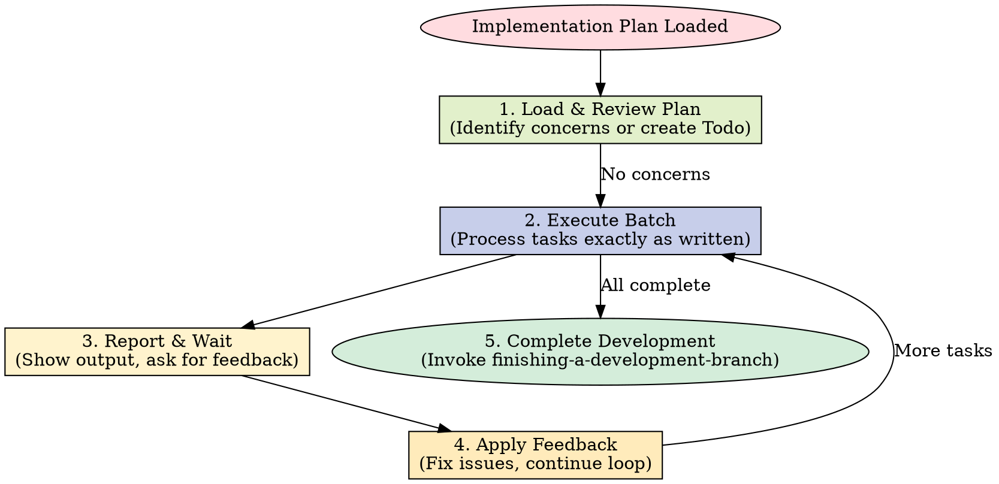

# Executing Plans

## Overview

Load plan, review critically, execute tasks in batches, report for review between batches.

**Core principle:** Batch execution with checkpoints for architect review.

**Announce at start:** "I'm using the executing-plans skill to implement this plan."

## The Process

**MANDATORY WORKFLOW:**

1. **Load and Review Plan:** Read the plan, raise concerns with human FIRST, or proceed if clear.
2. **Execute Batch:** Work on the next set of tasks in isolation, test them, and mark as completed.
3. **Report:** Stop and report progress to human partner. DO NOT proceed without review.
4. **Continue:** Based on feedback, execute the next batch.
5. **Complete:** Only when all tasks are done, invoke `finishing-a-development-branch` skill.

### Step 5: Complete Development

After all tasks complete and verified:

- Announce: "I'm using the finishing-a-development-branch skill to complete this work."
- **REQUIRED SUB-SKILL:** Use superpowers:finishing-a-development-branch
- Follow that skill to verify tests, present options, execute choice

## When to Stop and Ask for Help

**STOP executing immediately when:**

- Hit a blocker mid-batch (missing dependency, test fails, instruction unclear)
- Plan has critical gaps preventing starting
- You don't understand an instruction
- Verification fails repeatedly

**Ask for clarification rather than guessing.**

## When to Revisit Earlier Steps

**Return to Review (Step 1) when:**

- Partner updates the plan based on your feedback
- Fundamental approach needs rethinking

**Don't force through blockers** - stop and ask.

## Remember

- Review plan critically first
- Follow plan steps exactly
- Don't skip verifications
- Reference skills when plan says to
- Between batches: just report and wait
- Stop when blocked, don't guess
- Never start implementation on main/master branch without explicit user consent

## Integration

**Required workflow skills:**

- **superpowers:using-git-worktrees** - REQUIRED: Set up isolated workspace before starting
- **superpowers:writing-plans** - Creates the plan this skill executes
- **superpowers:finishing-a-development-branch** - Complete development after all tasks

## 中文执行层

### 触发条件
- Use when you have a written implementation plan to execute in a separate session with review checkpoints

### 前置条件
- 已确认当前任务与本 skill 的适用范围匹配。
- 已读取本文件的关键步骤，并确认命令路径基于仓库真实文件。
- 若依赖外部工具或凭据，先执行最小可用性检查（如 --help 或版本检查）。

### 执行步骤
1. 先按本 skill 的流程章节确认边界和产出物。
2. 先执行最小可验证步骤，再逐步扩展到完整实现。
3. 过程中的关键命令、输入和结果要记录到可复盘证据中。
4. 若与 AGENTS.md 路由冲突，以项目级约定和任务目标为准。

### 完成证据
- 提供关键命令与输出摘要，必要时附日志或报告文件路径。
- 列出受影响文件和核心改动点，确保与需求一一对应。
- 明确说明验证是否通过，以及尚未覆盖的风险。

### 失败回退
- 失败时先保留现场与报错信息，再定位根因并重试。
- 如需降级方案，必须说明影响范围、回退路径和补偿措施。

