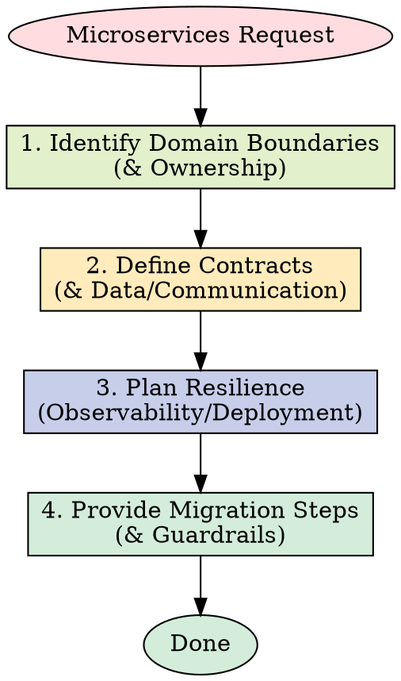

# Microservices Patterns

Master microservices architecture patterns including service boundaries, inter-service communication, data management, and resilience patterns for building distributed systems.

## Use this skill when

- Decomposing monoliths into microservices
- Designing service boundaries and contracts
- Implementing inter-service communication
- Managing distributed data and transactions
- Building resilient distributed systems
- Implementing service discovery and load balancing
- Designing event-driven architectures

## Do not use this skill when

- The system is small enough for a modular monolith
- You need a quick prototype without distributed complexity
- There is no operational support for distributed systems

## Instructions

**MANDATORY STEPS BEFORE CODING:**

1. Identify domain boundaries and ownership for each service.
2. Define contracts, data ownership, and communication patterns.
3. Plan resilience, observability, and deployment strategy.
4. Provide migration steps and operational guardrails.

## Resources

- `resources/implementation-playbook.md` for detailed patterns and examples.

## 中文执行层

### 触发条件
- Use when building distributed systems, decomposing monoliths, or implementing microservices to access patterns for service boundaries, event-driven communication, and resilience.

### 前置条件
- 已确认当前任务与本 skill 的适用范围匹配。
- 已读取本文件的关键步骤，并确认命令路径基于仓库真实文件。
- 若依赖外部工具或凭据，先执行最小可用性检查（如 --help 或版本检查）。

### 执行步骤
1. 先按本 skill 的流程章节确认边界和产出物。
2. 先执行最小可验证步骤，再逐步扩展到完整实现。
3. 过程中的关键命令、输入和结果要记录到可复盘证据中。
4. 若与 AGENTS.md 路由冲突，以项目级约定和任务目标为准。

### 完成证据
- 提供关键命令与输出摘要，必要时附日志或报告文件路径。
- 列出受影响文件和核心改动点，确保与需求一一对应。
- 明确说明验证是否通过，以及尚未覆盖的风险。

### 失败回退
- 失败时先保留现场与报错信息，再定位根因并重试。
- 如需降级方案，必须说明影响范围、回退路径和补偿措施。

