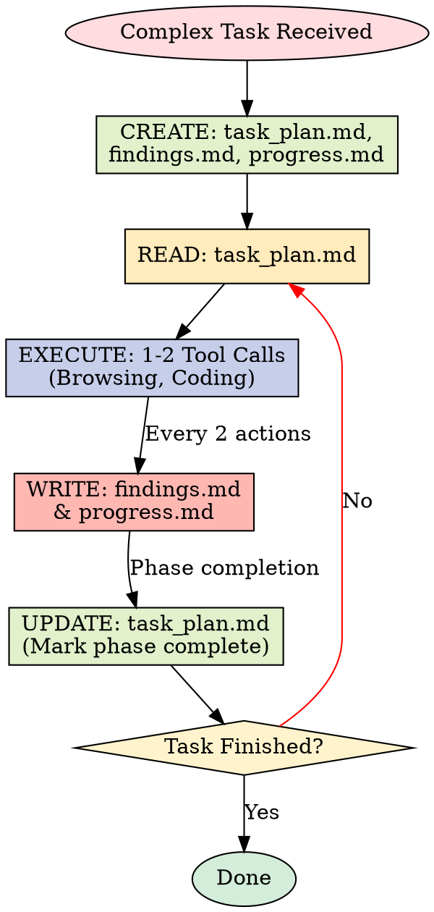

# Planning with Files

Work like Manus: Use persistent markdown files as your "working memory on disk."

## FIRST: Check for Previous Session (v2.2.0)

**Before starting work**, check for unsynced context from a previous session:

```bash
# Linux/macOS
$(command -v python3 || command -v python) ${CODEX_SKILL_ROOT}/scripts/session-catchup.py "$(pwd)"
```

```powershell
# Windows PowerShell
& (Get-Command python -ErrorAction SilentlyContinue).Source "$env:USERPROFILE\.codex\skills\planning-with-files\scripts\session-catchup.py" (Get-Location)
```

If catchup report shows unsynced context:

1. Run `git diff --stat` to see actual code changes
2. Read current planning files
3. Update planning files based on catchup + git diff
4. Then proceed with task

## Important: Where Files Go

- **Templates** are in `${CODEX_SKILL_ROOT}/templates/`
- **Your planning files** go in **your project directory**

| Location | What Goes There |
|----------|-----------------|
| Skill directory (`${CODEX_SKILL_ROOT}/`) | Templates, scripts, reference docs |
| Your project directory | `task_plan.md`, `findings.md`, `progress.md` |

## Quick Start

Before ANY complex task:

1. **Create `task_plan.md`** — Use [templates/task_plan.md](templates/task_plan.md) as reference
2. **Create `findings.md`** — Use [templates/findings.md](templates/findings.md) as reference
3. **Create `progress.md`** — Use [templates/progress.md](templates/progress.md) as reference
4. **Re-read plan before decisions** — Refreshes goals in attention window
5. **Update after each phase** — Mark complete, log errors

> **Note:** Planning files go in your project root, not the skill installation folder.

## The Core Pattern



Context Window = RAM (volatile, limited)
Filesystem = Disk (persistent, unlimited)
→ Anything important gets written to disk immediately.

## File Purposes

| File | Purpose | When to Update |
|------|---------|----------------|
| `task_plan.md` | Phases, progress, decisions | After each phase |
| `findings.md` | Research, discoveries | After ANY discovery |
| `progress.md` | Session log, test results | Throughout session |

## Critical Rules

### 1. Create Plan First

Never start a complex task without `task_plan.md`. Non-negotiable.

### 2. The 2-Action Rule
>
> "After every 2 view/browser/search operations, IMMEDIATELY save key findings to text files."

This prevents visual/multimodal information from being lost.

### 3. Read Before Decide

Before major decisions, read the plan file. This keeps goals in your attention window.

### 4. Update After Act

After completing any phase:

- Mark phase status: `in_progress` → `complete`
- Log any errors encountered
- Note files created/modified

### 5. Log ALL Errors

Every error goes in the plan file. This builds knowledge and prevents repetition.

```markdown
## Errors Encountered
| Error | Attempt | Resolution |
|-------|---------|------------|
| FileNotFoundError | 1 | Created default config |
| API timeout | 2 | Added retry logic |
```

### 6. Never Repeat Failures

```
if action_failed:
    next_action != same_action
```

Track what you tried. Mutate the approach.

## The 3-Strike Error Protocol

```
ATTEMPT 1: Diagnose & Fix
  → Read error carefully
  → Identify root cause
  → Apply targeted fix

ATTEMPT 2: Alternative Approach
  → Same error? Try different method
  → Different tool? Different library?
  → NEVER repeat exact same failing action

ATTEMPT 3: Broader Rethink
  → Question assumptions
  → Search for solutions
  → Consider updating the plan

AFTER 3 FAILURES: Escalate to User
  → Explain what you tried
  → Share the specific error
  → Ask for guidance
```

## Read vs Write Decision Matrix

| Situation | Action | Reason |
|-----------|--------|--------|
| Just wrote a file | DON'T read | Content still in context |
| Viewed image/PDF | Write findings NOW | Multimodal → text before lost |
| Browser returned data | Write to file | Screenshots don't persist |
| Starting new phase | Read plan/findings | Re-orient if context stale |
| Error occurred | Read relevant file | Need current state to fix |
| Resuming after gap | Read all planning files | Recover state |

## The 5-Question Reboot Test

If you can answer these, your context management is solid:

| Question | Answer Source |
|----------|---------------|
| Where am I? | Current phase in task_plan.md |
| Where am I going? | Remaining phases |
| What's the goal? | Goal statement in plan |
| What have I learned? | findings.md |
| What have I done? | progress.md |

## When to Use This Pattern

**Use for:**

- Multi-step tasks (3+ steps)
- Research tasks
- Building/creating projects
- Tasks spanning many tool calls
- Anything requiring organization

**Skip for:**

- Simple questions
- Single-file edits
- Quick lookups

## Templates

Copy these templates to start:

- [templates/task_plan.md](templates/task_plan.md) — Phase tracking
- [templates/findings.md](templates/findings.md) — Research storage
- [templates/progress.md](templates/progress.md) — Session logging

## Scripts

Helper scripts for automation:

- `scripts/init-session.sh` — Initialize all planning files
- `scripts/check-complete.sh` — Verify all phases complete
- `scripts/init-session.ps1` — Windows PowerShell initializer
- `scripts/check-complete.ps1` — Windows PowerShell completion check
- `scripts/session-catchup.py` — Recover context from previous session (v2.2.0)

Windows note:

- On Windows, prefer `.ps1` scripts.
- `.sh` scripts are intended for Linux/macOS shells.

## Advanced Topics

- **Manus Principles:** See [reference.md](reference.md)
- **Real Examples:** See [examples.md](examples.md)

## Anti-Patterns

| Don't | Do Instead |
|-------|------------|
| Use task_plan.md 清单 for persistence | Create task_plan.md file |
| State goals once and forget | Re-read plan before decisions |
| Hide errors and retry silently | Log errors to plan file |
| Stuff everything in context | Store large content in files |
| Start executing immediately | Create plan file FIRST |
| Repeat failed actions | Track attempts, mutate approach |
| Create files in skill directory | Create files in your project |

## 中文执行层

### 触发条件
- Use when starting a complex multi-step task, a research project, any task requiring >5 tool calls, or when taking over an existing project recovering from a previous session.

### 前置条件
- 已确认当前任务与本 skill 的适用范围匹配。
- 已读取本文件的关键步骤，并确认命令路径基于仓库真实文件。
- 若依赖外部工具或凭据，先执行最小可用性检查（如 --help 或版本检查）。

### 执行步骤
1. 先按本 skill 的流程章节确认边界和产出物。
2. 先执行最小可验证步骤，再逐步扩展到完整实现。
3. 过程中的关键命令、输入和结果要记录到可复盘证据中。
4. 若与 AGENTS.md 路由冲突，以项目级约定和任务目标为准。

### 完成证据
- 提供关键命令与输出摘要，必要时附日志或报告文件路径。
- 列出受影响文件和核心改动点，确保与需求一一对应。
- 明确说明验证是否通过，以及尚未覆盖的风险。

### 失败回退
- 失败时先保留现场与报错信息，再定位根因并重试。
- 如需降级方案，必须说明影响范围、回退路径和补偿措施。

