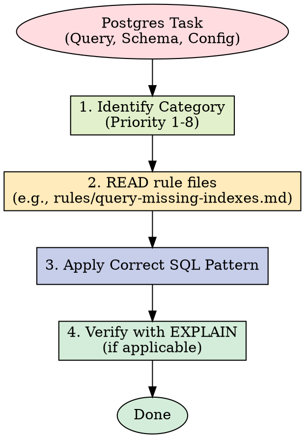

# Supabase Postgres Best Practices

Comprehensive performance optimization guide for Postgres, maintained by Supabase. Contains rules across 8 categories, prioritized by impact to guide automated query optimization and schema design.

## When to Apply

Reference these guidelines when:

- Writing SQL queries or designing schemas
- Implementing indexes or query optimization
- Reviewing database performance issues
- Configuring connection pooling or scaling
- Optimizing for Postgres-specific features
- Working with Row-Level Security (RLS)

## Rule Categories by Priority

| Priority | Category | Impact | Prefix |
|----------|----------|--------|--------|
| 1 | Query Performance | CRITICAL | `query-` |
| 2 | Connection Management | CRITICAL | `conn-` |
| 3 | Security & RLS | CRITICAL | `security-` |
| 4 | Schema Design | HIGH | `schema-` |
| 5 | Concurrency & Locking | MEDIUM-HIGH | `lock-` |
| 6 | Data Access Patterns | MEDIUM | `data-` |
| 7 | Monitoring & Diagnostics | LOW-MEDIUM | `monitor-` |
| 8 | Advanced Features | LOW | `advanced-` |

## How to Use



Read individual rule files for detailed explanations and SQL examples:

```
rules/query-missing-indexes.md
rules/schema-partial-indexes.md
rules/_sections.md
```

Each rule file contains:

- Brief explanation of why it matters
- Incorrect SQL example with explanation
- Correct SQL example with explanation
- Optional EXPLAIN output or metrics
- Additional context and references
- Supabase-specific notes (when applicable)

## Full Compiled Document

For the complete guide with all rules expanded: `AGENTS.md`

## 中文执行层

### 触发条件
- Use when writing, reviewing, or optimizing Postgres queries, designing schemas, working with RLS, or configuring databases.

### 前置条件
- 已确认当前任务与本 skill 的适用范围匹配。
- 已读取本文件的关键步骤，并确认命令路径基于仓库真实文件。
- 若依赖外部工具或凭据，先执行最小可用性检查（如 --help 或版本检查）。

### 执行步骤
1. 先按本 skill 的流程章节确认边界和产出物。
2. 先执行最小可验证步骤，再逐步扩展到完整实现。
3. 过程中的关键命令、输入和结果要记录到可复盘证据中。
4. 若与 AGENTS.md 路由冲突，以项目级约定和任务目标为准。

### 完成证据
- 提供关键命令与输出摘要，必要时附日志或报告文件路径。
- 列出受影响文件和核心改动点，确保与需求一一对应。
- 明确说明验证是否通过，以及尚未覆盖的风险。

### 失败回退
- 失败时先保留现场与报错信息，再定位根因并重试。
- 如需降级方案，必须说明影响范围、回退路径和补偿措施。

